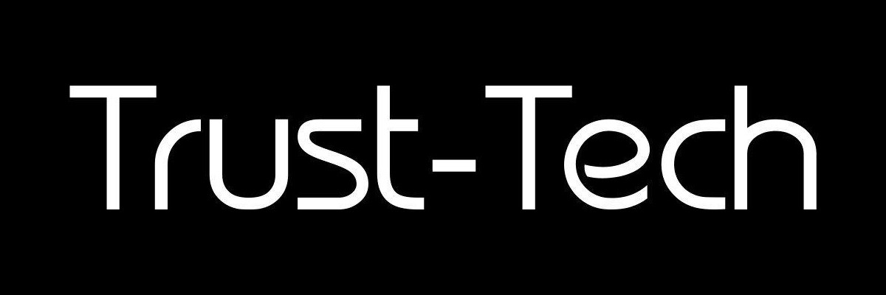

# Trustmachine Blackpaper v0.6
It is recommended that the signature of the blackpaper should be verified by gpg before you read the paper.
* Blackpaper Signature[Download](https://github.com/trust-tech/blackpaper/raw/master/blackpaper.pdf.asc)
* Blackpaper [Download](https://github.com/trust-tech/blackpaper/raw/master/blackpaper.pdf)
* Token Distribution Economics Signature [Download](https://github.com/trust-tech/blackpaper/raw/master/tokendistribution.pdf.asc)
* Token Distribution Economics [Download](https://github.com/trust-tech/blackpaper/raw/master/tokendistribution.pdf)


Note that the blackpaper and token distribution economics are still at draft stage and they will be completed in days. At this stage, We should:

- [x] elaborate on key ideas
- [x] present a central argument/point
- [x] organize thoughts
- [x] explain examples/ideas
- [x] develop a more cohesive text
- [ ] absorb most innovations in the industry
- [ ] finish detailing every subproject
- [ ] organize in a more structured way
- [ ] formally specify all the protocol
- [ ] audit and fix possible issues

We visioned that the decentralized world trustmachine will be built upon typed lambda calculi which is formally verifiable and thus secure enough to handle complex activities. Although Trustmachine borrows many ideas that have already been tried and tested for half a decade in older cryptocurrencies like Bitcoin and Ethereum, there are a number of places in which Trustmachine diverges from the most common way of handling certain protocol features, and there are also many situations in which Trustmachine has been forced to develop completely new economic approaches because it offers functionality that is not offered by other existing systems. The purpose of this document will be to detail all of the finer potentially nonobvious or in some cases controversial decisions that were made in the process of building the Trustmachine protocol, as well as showing the risks involved in both our approach and possible alternatives.

## Signature Verification And Message Encryption
Digital signature is a process ensuring that a certain package was generated by its developers and has not been tampered with.
Below we explain why it is important and how to verify that the blackpaper as well as some other software you download is the one
we have created and has not been modified by some attacker. Digital signature is a cryptographic mechanism. 
f you want to learn
more about how it works see https://en.wikipedia.org/wiki/Digital_signature.
### What Is A Signature And Why Should I Check It? How do you know that the software you have is really the one we made?
Digital signatures ensure that the package you are downloading was created by our developers. It uses a cryptographic mechanism to
ensure that the software package that you have just downloaded is authentic. For every user it is a must to verify that the software
is authentic as they have very real adversaries who might try to give them a fake version. If the software package as well as the
blackpaper has been modified by some attacker it is not safe to use. It doesn’t matter how secure our package is if you’re not running
the real one. Before you go ahead and download something, there are a few extra steps you should take to make sure you have
downloaded an authentic version. Below is an example of how to verify whether the blackpaper.pdf is the one that we produce:
1. Import the public key of trust-tech.org(trust-tech@protonmail.com):
```
    gpg --keyserver keys.gnupg.net --recv-keys 04BDC75EA19166D13F3F151448826F5500731B61
```
2. After importing the key, you can verify that the fingerprint is correct:
```
    gpg --fingerprint 04BDC75EA19166D13F3F151448826F5500731B61
```
3. You Should See:
```
    pub   rsa4096 2017-11-30 [SC] [expires: 2018-11-30]
          04BD C75E A191 66D1 3F3F  1514 4882 6F55 0073 1B61
    uid           [ultimate] Trust-Tech (Trust-Tech.org Official) <Trust-Tech@protonmail.com>
    sub   rsa4096 2017-11-30 [E] [expires: 2018-11-30]
```
4. To verify the signature of the file you downloaded, you will need to download the ”.asc” file as well. Assuming the file is at the current directory, run:
```
    gpg --verify blackpaper.pdf.asc blackpaper.pdf
```
5. The output should say ”Good signature”:
```
    gpg: Signature made Wed 06 Dec 2017 02:39:33 AM EST
    gpg:                using RSA key 48826F5500731B61
    gpg: Good signature from "Trust-Tech (Trust-Tech.org Official) <Trust-Tech@protonmail.com>" [ultimate]
```
### How To Use GPG to Encrypt and Sign Messages?
It is recommended that all the important messages sent between you and us are encrypted with gpg and assuming you have properly generated gpg key pairs and well configured and secured.
1. Import
the public key of trust-tech.org(trust-tech@protonmail.com):
```
    gpg --keyserver keys.gnupg.net --recv-keys 04BDC75EA19166D13F3F151448826F5500731B61
```
2. After importing the key, you can verify that the fingerprint is correct:
```
    gpg --fingerprint 4AAB89C770CF38E68C9D41BE6AEBE3BCE00AA58D
```
3. You Should See:```
```
    pub   rsa4096 2017-11-30 [SC] [expires: 2018-11-30]
          04BD C75E A191 66D1 3F3F  1514 4882 6F55 0073 1B61
    uid           [ultimate] Trust-Tech (Trust-Tech.org Official) <Trust-Tech@protonmail.com>
    sub   rsa4096 2017-11-30 [E] [expires: 2018-11-30]
```
4. To encrypt the messages that you wish to send to us:
```
    gpg --output document_file.gpg --encrypt --recipient trust-tech@protonmail.com document_file
```
5. To decrypt the messages that we sent to you:
```
    gpg --output document_file --decrypt document_file.gpg
```
For More detail, please refer to the guidelines described in the The GNU Privacy Handbook:
https://www.gnupg.org/gph/en/manual/book1.html
